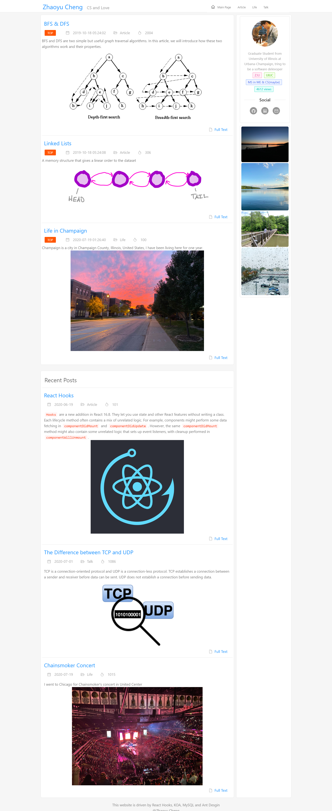
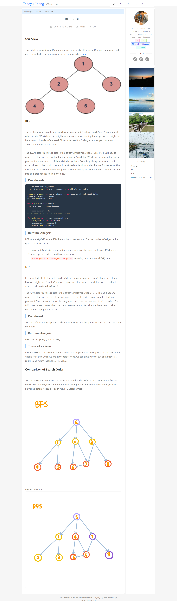
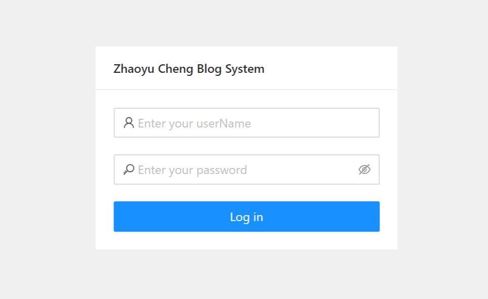
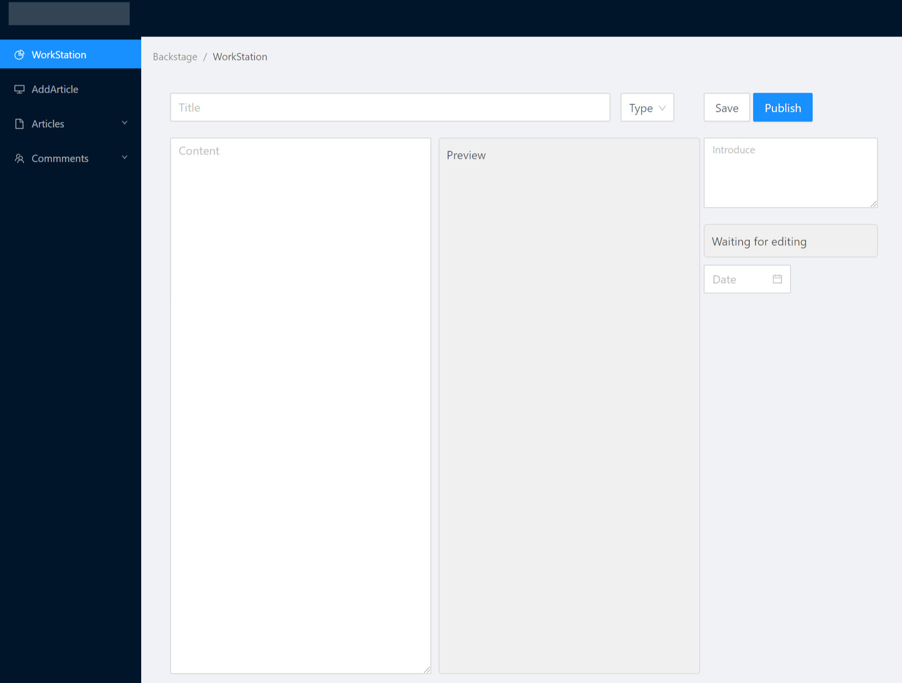
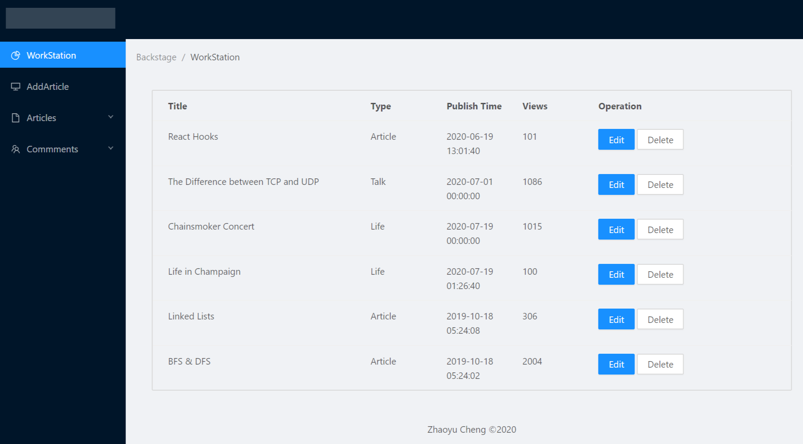
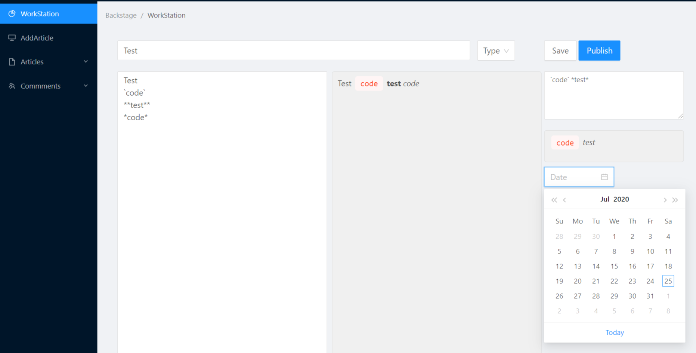

# React Blog System
# Front End
This blog system is driven by React Hooks, Egg.js, MySQL and Antd design.
## Main Page
This is the main page for this blog

## Detailed Page
The detailed page supports **Markdown** and **syntax highlighting** with the help of `hightlight.js` and `marked`

# Framework
[egg.js](https://eggjs.org/en/index.html)

# Backstage
## Login page

## Add Article

## Article List

## Intime Preview
The adding article function supports intime preview for what you are writing

